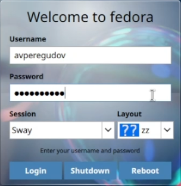
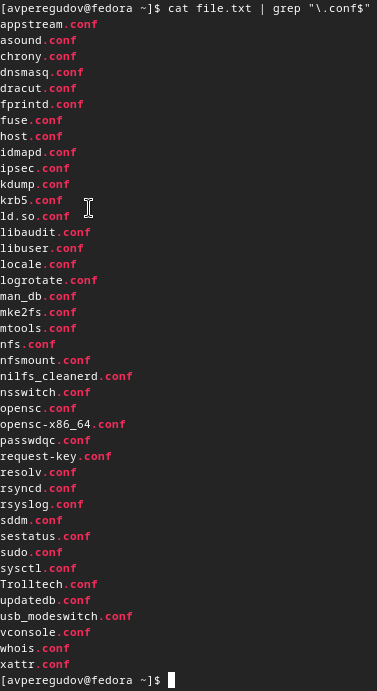
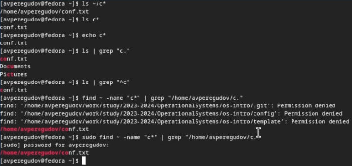
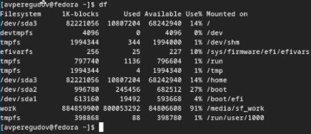
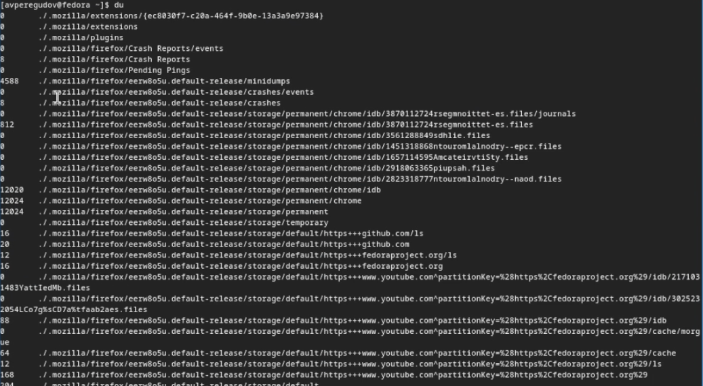
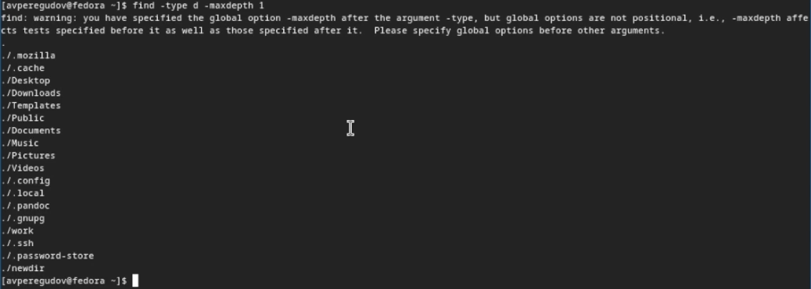

---
## Front matter
lang: ru-RU
title: Лабораторная работа № 8
subtitle: Операционные системы
author:
  - Перегудов А.В.
institute:
  - Российский университет дружбы народов, Москва, Россия
date: 30 марта 2024

## i18n babel
babel-lang: russian
babel-otherlangs: english

## Fonts
mainfont: PT Serif
romanfont: PT Serif
sansfont: PT Sans
monofont: PT Mono
mainfontoptions: Ligatures=TeX
romanfontoptions: Ligatures=TeX
sansfontoptions: Ligatures=TeX,Scale=MatchLowercase
monofontoptions: Scale=MatchLowercase,Scale=0.9

## Formatting pdf
toc: false
toc-title: Содержание
slide_level: 2
aspectratio: 169
section-titles: true
theme: metropolis
header-includes:
 - \metroset{progressbar=frametitle,sectionpage=progressbar,numbering=fraction}
 - '\makeatletter'
 - '\beamer@ignorenonframefalse'
 - '\makeatother'
---

# Информация

## Докладчик

  * Перегудов Александр Вадимович
  * Студент группы НКАбд-04-23
  * Российский университет дружбы народов
  * [1132239659@pfur.ru]
  * <https://github.com/magister6239/study_2023-2024_os-intro>

# Вводная часть

Поиск файлов. Перенаправление ввода-вывода. Просмотр запущенных процессов

## Актуальность

- Умение использовать инструменты поиска файлов является ключевым навыком.
- Перенаправление ввода-вывода используется для множества задач, включая перенаправление вывода команды в файл, чтение ввода из файла вместо стандартного потока ввода и т. д. Это необходимо как для повседневных задач, так и для автоматизации и сценариев оболочки.
- Мониторинг и управление процессами - важная задача для администраторов систем и разработчиков. Знание того, как работать с процессами позволит выполнять более широкий спектр задач и облегчить работу с системой.

## Объект и предмет исследования

- концепция конвеера
- концепция потоков
- find
- grep
- df
- du
- ps
- kill

## Цели и задачи

Получение навыков поиска файлов, управления процессами и работы с потоками ввода-вывода.

## Материалы и методы

- Процессор `pandoc` для входного формата Markdown
- Результирующие форматы
	- `pdf`
	- `html`
- Автоматизация процесса создания: `Makefile`

## Вход в систему

{width=70%}

## Запись в файл file.txt 

{width=70%}

## Запись в файл file.txt

{width=70%}

## Вывод файла file.txt

{width=70%}

## Вывод всех файлов с расширением .conf

{width=70%}

## Запись файлов с расширением .conf в файл conf.txt

{width=70%}

## Файлы на "c" 

{width=70%}

## Файлы на "h"

{width=70%}

{width=70%}

## Запуск фонового процесса

{width=70%}

{width=70%}

{width=70%}

## Удаление файла logfile

{width=70%}

## Запуск gedit в фоновом режиме

{width=70%}

## Определение pid процесса gedit

{width=70%}

{width=70%}

## Вызов справки kill

{width=70%}

{width=70%}

## Завершение процесса

{width=70%}

## Команда df

{width=70%}

{width=70%}

{width=70%}

## Команда du

{width=70%}

{width=70%}

{width=70%}

## Вывод всех директорий домашнего каталога

{width=70%}

{width=70%}

{width=70%}
